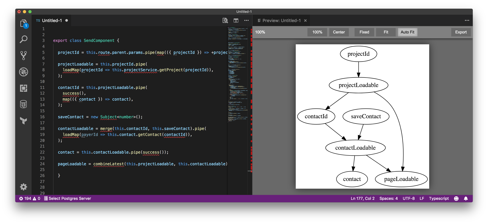

# TS Property DAG

An extension for Visual Studio Code to preview Typescript classes as directed acyclic graphs using Graphviz (DOT).

## Installation

You can install this extension from the
[Visual Studio Marketplace](https://marketplace.visualstudio.com/items?itemName=natessilva.ts-prop-dag).

## Usage

### Open preview

Open the [Command Palette](https://code.visualstudio.com/docs/getstarted/userinterface#_command-palette) (usually by
pressing <kbd>Ctrl</kbd> + <kbd>Shift</kbd> + <kbd>P</kbd>), then select “Prop DAG: Show Preview”.

### Manipulate preview

| Action           | Gesture                                                                                                                                       |
| ---------------- | --------------------------------------------------------------------------------------------------------------------------------------------- |
| Zoom in          | Mouse wheel up / <kbd>+</kbd>                                                                                                                 |
| Zoom out         | Mouse wheel down / <kbd>-</kbd>                                                                                                               |
| Toggle 100% zoom | Mouse double click / <kbd>Space</kbd>                                                                                                         |
| Pan              | Mouse drag / <kbd>Left</kbd> / <kbd>Right</kbd> / <kbd>Up</kbd> / <kbd>Down</kbd> / <kbd>A</kbd> / <kbd>D</kbd> / <kbd>W</kbd> / <kbd>S</kbd> |
| Zoom to 100%     | <kbd>0</kbd>                                                                                                                                  |
| Move to center   | <kbd>X</kbd>                                                                                                                                  |

There are three zooming modes: **Fixed**, **Fit** and **Auto Fit**.

- **Fixed**: The zoom ratio does not change when the source changes or the window size changes.
- **Fit**: The graph is scaled to align to the border of the visible view area.
- **Auto Fit**: When the view area is big enough to contain a 100% sized graph, the graph will be set a zoom ratio of
  100%, otherwise the graph is scaled to fit into the view area.

### Export graph

To export the generated graph, click the “Export” button on the top right corner.

## Configuration

| Configuration             | Type               | Description                                                                                                                                       |
| ------------------------- | ------------------ | ------------------------------------------------------------------------------------------------------------------------------------------------- |
| `propDag.dotPath` | `string` \| `null` | `null` means to use the “dot” program in your `PATH` environment variable, or a `string` value to indicate the “dot” program you want to use. |
| `propDag.engine`  | `"dot"` \| `null`  | The layout engine to use. `null` means to use the “dot” layout engine. Currently, only the “dot” engine is supported.                         |

Make sure the extension can find the “dot” program. You can set `propDag.dotPath` option to the path of the dot
executable, or make sure the directory containing the dot program is in your `PATH` environment variable.

To set the `propDag.dotPath` option, go to File → Preference → Settings.

## Known issues

- After saving an untitled file, the preview becomes invalid.
- When the zoom ratio is too large, the graph may be at a wrong position.
